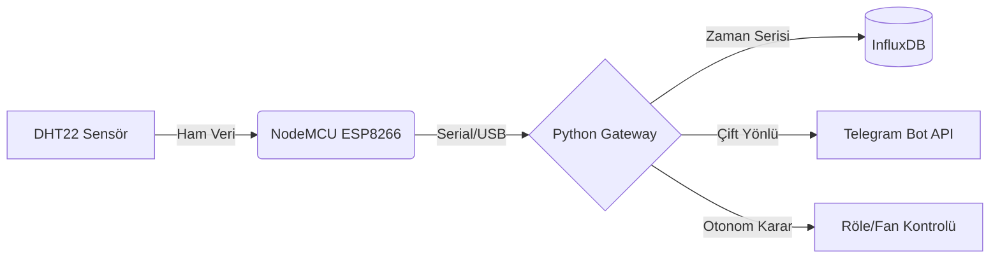

# 🛡️ AeroStat: Endüstriyel IoT Güvenlik ve Otonom Yaşam Destek Sistemi


**AeroStat**, basit bir sensör okuma projesinin ötesinde; otonom karar verme yeteneğine sahip, hata toleranslı (fault-tolerant) ve acil durum protokolleri içeren uçtan uca (end-to-end) bir **IoT Güvenlik Sistemidir.**

Gömülü sistemleri modern bulut teknolojileriyle birleştiren bu proje, ortam verilerini sadece kaydetmekle kalmaz; **analiz eder, yorumlar ve hayati tehlike durumlarında inisiyatif alarak acil müdahale süreçlerini (112 Arama vb.) başlatır.**

---

## 🏗️ Sistem Mimarisi

Sistem, **Edge Computing** (Uçta İşleme) prensibiyle çalışır. Sensör verisi ham olarak alınmaz, filtrelenir, işlenir ve anlamlı bilgiye dönüştürülerek kullanıcıya sunulur.




## 🚀 Öne Çıkan Teknik Özellikler

### 1. 🧠 Akıllı Güvenlik Çekirdeği (Safety Core)
Sistem, insan hayatını korumaya yönelik önceden tanımlanmış kritik eşiklere sahiptir:

🔥 Yangın Protokolü (>50°C): Sistem olası bir yangını tespit ettiğinde Telegram üzerinden "Yüksek Öncelikli Alarm" gönderir ve mesaj içerisine tek tıkla İtfaiyeyi (112) arama butonu yerleştirir.

❄️ Donma Protokolü (<5°C): Su tesisatının patlama riskine karşı erken uyarı sistemi devreye girer.

Sanity Check (Akıl Sağlığı Kontrolü): Sensörden gelen gürültülü veya fiziksel olarak imkansız verileri (Örn: -999°C, %200 Nem) veritabanına kaydetmeden önce süzer.

### 2. 🤖 Otonom Termostat ve Histerezis
Sistem, internet bağlantısı kopsa dahi yerel döngüde çalışmaya devam edebilir.

Kullanıcı tarafından belirlenen dinamik eşik değerlerine (Örn: /limit temp 28) göre fan veya ısıtıcıyı otomatik açar/kapatır.

Histerezis Algoritması: Cihazın sürekli açılıp kapanarak (flapping) bozulmasını önlemek için güvenli aralık (buffer zone) bırakır.

### 3. 🐕 Watchdog (Sistem Bekçisi) Modülü
Donanım dünyasında kablo kopması veya sensör arızası kaçınılmazdır.

AeroStat, ayrı bir Thread üzerinde çalışan "Watchdog" yazılımına sahiptir.

Sensörden 60 saniye boyunca veri gelmezse, kullanıcıya "⚠️ KRİTİK: Sensör Bağlantısı Koptu!" uyarısı gönderir. Bağlantı düzeldiğinde ayrıca rapor verir.

### 4. 🌍 Çoklu Dil Desteği (i18n)
Sistem, dinamik olarak dil değiştirme (Internationalization) yeteneğine sahiptir.

Telegram üzerinden /tr veya /en komutlarıyla anlık olarak Türkçe ve İngilizce arayüz arasında geçiş yapılabilir.

### 5. 📊 Veri Analitiği
InfluxDB'nin güçlü Flux Query dilini kullanarak, geçmiş veriler üzerinde anlık analiz yapar.

/analiz komutu ile son 1 saatlik sıcaklık ve nem ortalamalarını hesaplayıp trend raporu sunar.


## 🛠️ Kullanılan Teknolojiler ve Yöntemler

Python (Multi-Threading): Serial okuma, API dinleme ve Watchdog servisleri, sistemin bloklanmaması için eşzamanlı (concurrency) olarak farklı thread'lerde çalışır.

OOP & Clean Architecture: Kod yapısı SafetyManager, SmartController gibi modüler sınıflara ayrılmıştır.

InfluxDB: Verilerin zaman damgasıyla (Time-Series) milisaniye hassasiyetinde saklanması için kullanılmıştır.

Telegram Bot API: Kullanıcı ile sistem arasında çift yönlü (Bi-directional) iletişim sağlar.


## 📸 Kullanım ve Komutlar
Bot ile etkileşime geçmek için Telegram üzerinden aşağıdaki komutları kullanabilirsiniz:

| Komut | Açıklama |
| :--- | :--- |
| `/start` | Sistemi ve asistanı başlatır. |
| `/durum` | Anlık sensör verisi, sistem sağlığı ve risk raporu. |
| `/oto` | Otonom Termostat modunu açar/kapatır. |
| `/limit temp [değer]` | Termostat tetikleme sıcaklığını ayarlar (Örn: `/limit temp 26`). |
| `/analiz` | Son 1 saatin veri analitiği raporunu sunar. |
| `/test` | Acil Durum (Yangın) protokolünü simüle eder. |
| `/sustur` | Kritik olmayan bildirimleri sessize alır. |
| `/tr` - `/en` | Dili Türkçe veya İngilizce olarak değiştirir. |


## 📦 Kurulum

### 1. Donanım Bağlantısı:

Projenin çalışması için aşağıdaki donanım bağlantılarını yapmanız ve yazılım parametrelerini ayarlamanız gerekmektedir.

#### a. Gerekli Malzemeler (BOM)
* **Mikrodenetleyici:** NodeMCU v3 (ESP8266) veya ESP32.
* **Sensör:** DHT22 (Sıcaklık ve Nem Sensörü) - *DHT11 kullanacaksanız kodda `DHTTYPE` değiştirilmelidir.*
* **Aktüatör (Opsiyonel):** 5V Röle Modülü (Fan, Isıtıcı veya Lamba kontrolü için).
* **Bağlantı:** Jumper kablolar, Breadboard ve Veri aktarımlı Micro-USB kablo.

#### b. Devre Bağlantı Şeması (Pinout)

Sensör ve Röle modülünü NodeMCU'ya aşağıdaki tabloya göre bağlayın:

| Bileşen | Pin Ucu | NodeMCU Pini | GPIO Karşılığı | Açıklama |
| :--- | :--- | :--- | :--- | :--- |
| **DHT22** | VCC (+) | 3V3 | - | 3.3V Güç Hattı |
| **DHT22** | GND (-) | GND | - | Topraklama |
| **DHT22** | DATA | **D2** | GPIO 4 | Sensör Veri Okuma |
| **Röle** | VCC | VIN / 3V3 | - | 5V veya 3.3V Güç |
| **Röle** | GND | GND | - | Topraklama |
| **Röle** | IN | **D4** | GPIO 2 | Tetikleme Pini (Dahili LED ile paralel) |

> **⚠️ Önemli Not:** NodeMCU üzerinde pinler "D1, D2" olarak yazar ancak Arduino IDE kodunda bunlar GPIO numaralarıyla (4, 2 vb.) eşleşir. Kodda `DHTPIN 4` yazması fiziksel olarak `D2` pinini temsil eder.

### 3. Yazılım Konfigürasyonu

Sistemi ayağa kaldırmak için aşağıdaki 3 adımı takip edin:

#### a. Telegram Bot Kurulumu
1.  Telegram uygulamasında **@BotFather** kullanıcısını bulun.
2.  `/newbot` komutunu gönderin ve botunuza bir isim verin.
3.  Size verilen **HTTP API TOKEN**'ı kaydedin.
4.  Kendi kullanıcı ID'nizi öğrenmek için **@userinfobot**'a `/start` yazın ve `Id` numaranızı not edin.

#### b. Veritabanı (InfluxDB) Kurulumu
Verilerin saklanacağı zaman serisi veritabanını Docker ile tek komutta kurun:

```bash
docker run -d -p 8086:8086 \
  --name influxdb \
  -v influxdb_data:/var/lib/influxdb2 \
  influxdb:2.0
```

### 3. Veritabanı (Docker):

```bash
docker run -d -p 8086:8086 --name influxdb influxdb:2.0
```

### 4. Kütüphaneler:

```bash
pip install -r requirements.txt
```

### 5. Konfigürasyon:

Tarayıcıdan http://localhost:8086 adresine giderek kurulumu tamamlayın, bir Organizasyon (Org) ve Kova (Bucket) oluşturun. Size verilen Token'ı kopyalayın.
src/bridge.py dosyasındaki TOKEN ve ID alanlarını güncelleyin.


> **⚠️ Önemli Not:** Windows'ta doğru COM portunu bulmak için Aygıt Yöneticisi -> Bağlantı Noktaları (COM & LPT) kısmına bakın. Sürücü olarak genellikle CH340 veya CP2102 görünür. Sürücü eğer mevcut değilse https://www.wch-ic.com/downloads/CH341SER_EXE.html adresinden sürücüyü indirebilirsiniz.

### 6. Başlatma:

```bash
python src/bridge.py
```

## 📄 Lisans
Bu proje MIT Lisansı ile açık kaynak olarak sunulmuştur.

